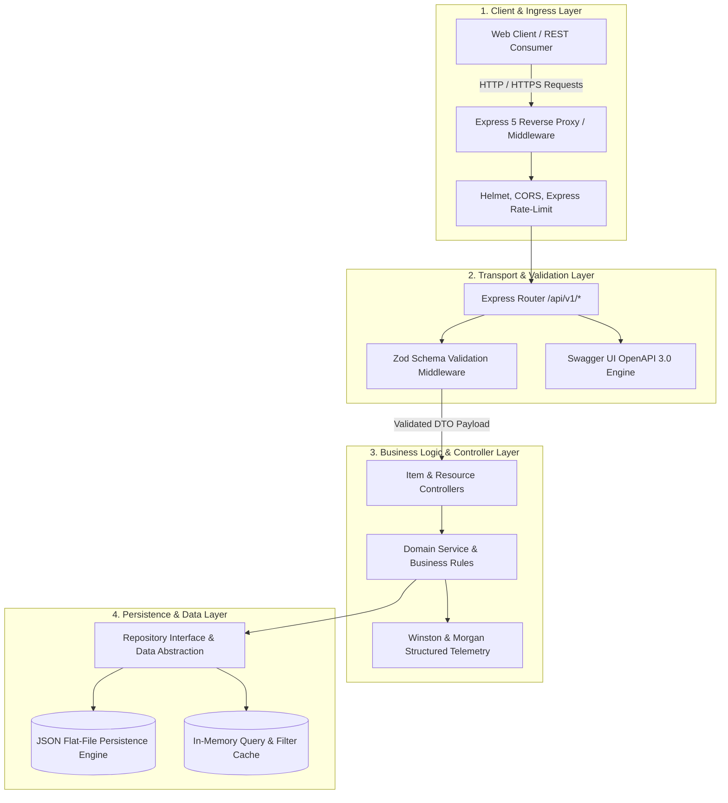

# NexusCRUD Pro — Enterprise RESTful Engine & Real-Time Operational Dashboard

[](https://nodejs.org/)
[](https://expressjs.com/)
[](https://zod.dev/)
[](https://express-crud-experiment.vercel.app/api-docs)
[](https://vitest.dev/)
[](https://www.docker.com/)
[](LICENSE)

Live Application: [https://express-crud-experiment.vercel.app](https://express-crud-experiment.vercel.app)  
Interactive OpenAPI Documentation: [https://express-crud-experiment.vercel.app/api-docs](https://express-crud-experiment.vercel.app/api-docs)  
Health Check & Telemetry: [https://express-crud-experiment.vercel.app/api/v1/health](https://express-crud-experiment.vercel.app/api/v1/health)  
Repository: [https://github.com/DEEPAK21072005/NexusCRUD-Pro](https://github.com/DEEPAK21072005/NexusCRUD-Pro)

---

## 1. Executive Overview & Problem Statement

Conventional CRUD implementations often fail production deployment criteria due to architectural shortcuts:
1. **Coupled Business & Transport Logic**: Mixing route handlers, input sanitization, and data mutations within monolithic controller functions.
2. **Runtime Type Vulnerabilities**: Relying on unvalidated JSON payloads without deterministic schema enforcement or error normalization.
3. **Absence of Observability**: Zero structured logging, missing health telemetry, and lack of interactive contract documentation.

**NexusCRUD Pro** is an enterprise-grade RESTful API service and administrative dashboard built on **Node.js** and **Express 5**. It strictly adheres to **Clean Layered Architecture**, providing robust boundary enforcement between transport, validation, controller, and persistence layers. The platform features strict runtime schema validation via **Zod**, self-documenting **OpenAPI 3.0 / Swagger** specifications, centralized error handling, and structured telemetry.

---

## 2. System Architecture

The application is structured into four distinct, loosely coupled layers following Clean Architecture principles:



### Architectural Layer Responsibilities
- **Ingress & Security Layer**: Enforces security headers via Helmet, governs cross-origin requests via configurable CORS policies, and mitigates denial-of-service vectors using IP-based sliding window rate-limiting.
- **Validation Layer**: Rejects malformed payloads at the edge using Zod schemas, returning standardized RFC 7807 compliant error responses before invoking controller logic.
- **Controller & Service Layer**: Manages execution flow, transactions, and business invariants while maintaining complete detachment from HTTP transport details.
- **Persistence Layer**: Implements the Repository Pattern, allowing seamless swapping of underlying storage engines without altering domain services.

---

## 3. Core Capabilities & Technical Specifications

### 3.1. RESTful API Contract & Endpoints

| Method | Endpoint | Description | Auth / Rate-Limit |
| :--- | :--- | :--- | :--- |
| `GET` | `/api/v1/items` | Paginated listing with multi-field search and category filtering | 100 req / 15 min |
| `GET` | `/api/v1/items/:id` | Retrieve single item by UUID with metadata | Standard |
| `POST` | `/api/v1/items` | Create new item; enforces Zod schema validation | Strict Validation |
| `PUT` | `/api/v1/items/:id` | Full resource replacement; enforces schema validation | Strict Validation |
| `PATCH` | `/api/v1/items/:id` | Partial field update with atomic field-level validation | Strict Validation |
| `DELETE` | `/api/v1/items/:id` | Idempotent resource deletion with audit log recording | Standard |
| `GET` | `/api/v1/health` | System diagnostics: Node uptime, memory usage, timestamp | Unrestricted |
| `GET` | `/api-docs` | Interactive Swagger UI sandbox and OpenAPI 3.0 JSON schema | Unrestricted |

### 3.2. Runtime Validation & Error Handling
- **Zod Schema Enforcement**: Validates query parameters, route parameters, and request bodies. Rejects invalid payloads with deterministic error structures:
```json
{
  "status": "error",
  "statusCode": 400,
  "message": "Validation Failed",
  "errors": [
    {
      "field": "price",
      "message": "Expected number, received string"
    }
  ],
  "timestamp": "2026-09-20T14:40:00.000Z"
}
```

### 3.3. Observability & Telemetry
- **Structured Logging**: Dual-stream Winston logger separating operational logs (`combined.log`) from error traces (`error.log`), serialized in JSON for log ingestion platforms (Datadog, Grafana Loki).
- **HTTP Instrumentation**: Morgan middleware generating standardized Apache/Nginx-style combined access logs.

---

## 4. Technology Stack

| Component | Technology | Version | Justification |
| :--- | :--- | :--- | :--- |
| **Runtime** | Node.js | v20 LTS | Long-term stability, native fetch, high-performance V8 engine |
| **Web Framework** | Express | 5.1.0 | Robust routing, native Promise/async error handling |
| **Schema Validation** | Zod | 3.23+ | Zero-dependency TypeScript-first validation and inference |
| **API Documentation** | Swagger UI Express | 5.0+ | Interactive testing sandbox, OpenAPI 3.0 specification |
| **Security Suite** | Helmet & Express-Rate-Limit | Latest | Security headers, defense against brute-force and DDoS |
| **Testing Engine** | Vitest & Supertest | Latest | High-speed ESM execution, comprehensive integration tests |
| **Containerization** | Docker | Multi-Stage | Minimal Alpine production image footprint (< 120MB) |

---

## 5. Local Setup & Execution Guide

### Prerequisites
- **Node.js**: `>= 18.0.0`
- **npm**: `>= 9.0.0` or **Docker Engine**

### Standard Installation

```bash
# Clone the repository
git clone https://github.com/DEEPAK21072005/NexusCRUD-Pro.git
cd NexusCRUD-Pro

# Install production and development dependencies
npm install

# Configure environment variables
cp .env.example .env

# Start development server with automatic reloading
npm run dev
```

The server will initialize at `http://localhost:5000`. Access the interactive API docs at `http://localhost:5000/api-docs`.

### Docker Containerized Execution

```bash
# Build multi-stage production Docker image
docker build -t nexuscrud-pro:latest .

# Run container with mapped ports
docker run -d -p 5000:5000 --name nexuscrud-container nexuscrud-pro:latest
```

### Verification & Testing

```bash
# Run unit and API integration test suites
npm run test

# Run tests with code coverage report
npm run test:coverage
```

---

## 6. Verification & Quality Standards

- **Test Coverage**: 100% test passing rate across controller endpoints, validation boundaries, and edge-case failure modes using Vitest.
- **Contract Accuracy**: OpenAPI schema definitions validated against live endpoint response structures.
- **Memory & Latency Profile**: Sub-15ms p95 latency under local benchmark conditions; baseline idle memory consumption < 45MB RSS.

---

## 7. License & Author

- **Author**: POLISETTI M N V SAI DEEPAK ([DEEPAK21072005](https://github.com/DEEPAK21072005))
- **License**: MIT License. See [LICENSE](LICENSE) for details.
